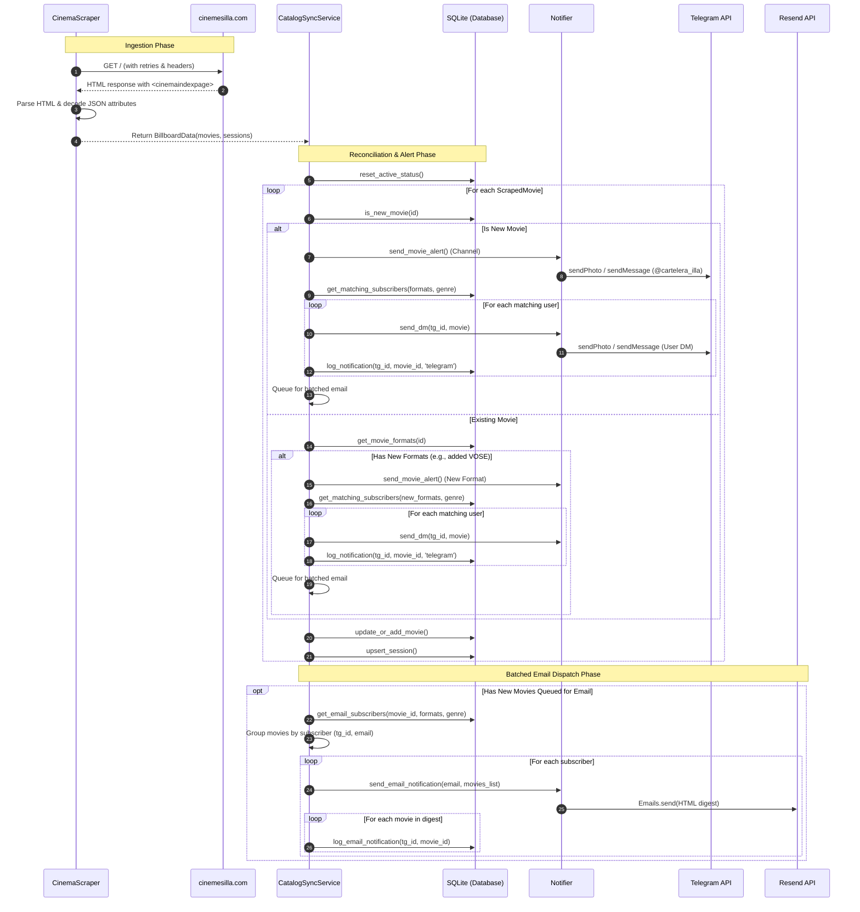

# Data Ingestion & Notification Pipeline

This document details the complete end-to-end data lifecycle in **Illa Notifier**: from HTTP extraction of cinema schedules to multi-channel message formatting and batched dispatch.

---

## 1. Pipeline Overview

Every 3,600 seconds (1 hour), the system executes a cycle orchestrated by `run_cycle()` in `src/main.py`:



---

## 2. Extraction & Ingestion (`scraper.py`)

### Target Structure
Rather than relying on classic DOM scraping of fragile CSS classes (`.movie-card`, `.showtime-item`), the cinema website renders a root Vue component:

```html
<cinemaindexpage 
    :postersurl='"https://media.cinemesilla.com/carteles/"'
    :onlytitlesinfo='[{"ID_Espectaculo": 13030, "Titulo": "GREENLAND 2", "NombreGenero": "Thriller", ...}]'
    :fullsessionsinfo='[{"ID_Pase": 105432, "ID_Espectaculo": 13030, "ID_Formato": 2, "NombreFormato": "VOSE", "HoraReal": "2026-03-30T19:00:00", ...}]'>
</cinemaindexpage>
```

### Parsing Pipeline
1. `requests.Session` with an `HTTPAdapter` configured for 5 retries on transient errors (500, 502, 503, 504).
2. `BeautifulSoup(html, "html.parser")` finds `<cinemaindexpage>`.
3. Attributes are unescaped (`html.unescape`) and deserialized using `json.loads()`.
4. Ticket purchasing URLs are programmatically constructed using URL encoding:
   ```python
   ticket_url = (
       f"https://cinemesilla.com/FilmTheaterPage"
       f"/{movie_id}"
       f"/{quote(title)}"
       f"/{cinema_id}"
       f"/{quote(cinema_name)}"
   )
   ```
5. Returns typed immutable dataclasses:
   - `ScrapedMovie`: `movie_id`, `title`, `genre`, `cinema_id`, `cinema_name`, `poster_url`, `ticket_url`.
   - `Session`: `id`, `movie_id`, `format_id`, `format_name`, `room_id`, `room_name`, `showtime`, `show_date`, `show_time`.
   - `BillboardData`: encapsulates all movies and a mapping `dict[int, list[Session]]`.

---

## 3. Reconciliation Logic (`sync_service.py`)

The synchronization engine uses a state-comparison algorithm:

### Step 1: Inactivation Reset
Calls `reset_active_status()`, setting `is_active = 0` on all existing records. This allows the system to detect when a movie or session has been removed from the cinema billboard without dropping historical logs.

### Step 2: Detection Branching
For every scraped movie:
- **Case A: Brand New Movie (`is_new_movie == True`)**
  - Sends immediate channel announcement to `@cartelera_illa`.
  - Queries user preferences: matches any subscriber who enabled either the movie's genre OR any of its scheduled format languages (`VOSE`, `CASTELLÀ`, etc.).
  - Sends personalized Telegram DM.
  - Queues movie data into memory for the email dispatch phase.
- **Case B: Existing Movie with New Formats**
  - If a movie was already known (e.g. was playing in `CASTELLÀ`), but the cinema adds a `VOSE` session later in the week:
  - Compares currently scraped formats with known formats in `sessions` table.
  - Alerts the channel specifically about the new language format available.
  - Alerts subscribers whose filters match the newly introduced format.
- **Persistence**:
  - `update_or_add_movie()` sets `is_active = 1` and updates posters if changed.
  - `upsert_session()` marks active sessions.

---

## 4. Multi-Channel Notification Dispatch (`notifier.py`)

### 1. Telegram Public Channel (`@cartelera_illa`)
- Formatted with Markdown.
- If a poster URL is available, dispatched via `sendPhoto` with caption; otherwise falls back to `sendMessage`.
- Includes an inline keyboard button directly linking to ticket purchasing (`🎟️ Get tickets`).

### 2. Telegram Subscriber Direct Messages (DMs)
- Sent individually to each matching `telegram_id`.
- Captions and buttons are localized in Spanish/Catalan friendly copy (`🎟️ Comprar entradas`).
- **Idempotency Guard**: Immediately records delivery in `notification_log(telegram_id, movie_id, channel='telegram')`. If the bot crashes and restarts mid-run, previously notified users are excluded from duplicate alerts.

### 3. Batched Email Notifications (Resend)
Sending an individual email for each newly discovered movie during a bulk catalog update would flood user inboxes. Illa Notifier implements **batching**:

1. New movies detected in the run are held in `new_movies_for_email`.
2. Aggregated by recipient: `dict[tuple[int, str], list[MovieData]]` maps `(telegram_id, email)` to all matching movies for that user.
3. A single responsive HTML digest email is generated containing dark-mode cards with posters, metadata tables, and ticket buttons.
4. Sent via `resend.Emails.send()` with up to 3 exponential backoff retries.
5. On success, every individual movie in the digest is recorded in `notification_log` with `channel='email'`.
