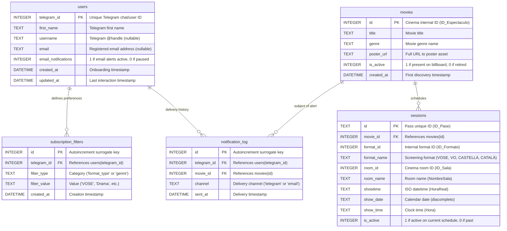

# Persistence & Schema Design

This document describes the database layer of **Illa Notifier**, detailing how state is persisted in SQLite, the data relationships, performance indexing, the PRAGMA execution environment, and how database migrations are applied automatically without external tooling.

---

## 1. Entity-Relationship Diagram (ERD)



---

## 2. Table Semantics

### `movies`
Maintains the catalog of films discovered on the website:
- **Primary Key**: Uses the cinema's native integer `ID_Espectaculo`.
- **Soft Deletion (`is_active`)**: At the beginning of each scrape cycle, all rows are set to `is_active = 0`. As movies are confirmed in the scrape, their flag is set back to `1`. This preserves historical notification links while identifying which movies are currently showing.

### `sessions`
Normalizes individual screening showtimes and technical formats (sound, 3D, language):
- **Primary Key**: Uses the cinema's native text `ID_Pase`.
- **`format_name`**: Stores strings such as `VOSE`, `CASTELLÀ`, `CATALÀ`. This column is queried to match user language preferences.

### `users`
Tracks users who have initiated conversation with the bot via `/start`:
- **Primary Key**: Telegram's unique 64-bit integer user identifier.
- **Email Attributes**: Stores the optional email address and the `email_notifications` toggle (controlled via `/email`).

### `subscription_filters`
Stores individual genre and language preferences configured by users:
- **Constraint**: `UNIQUE (telegram_id, filter_type, filter_value)` ensures idempotent toggling without row duplication.
- **Cascade**: Configured with `ON DELETE CASCADE` linked to `users.telegram_id`.

### `notification_log`
Enforces idempotency across independent delivery channels:
- **Composite Unique Constraint**: `UNIQUE (telegram_id, movie_id, channel)`.
  - Guarantees that a subscriber receives at most one Telegram DM and at most one email for any specific movie.
  - Keeps delivery channels decoupled: sending a Telegram DM does not block sending an email if the user configures their email address at a later date.

---

## 3. Query Optimization & Indexing

Indexes are created during startup to ensure that filtering queries execute in sub-millisecond times:

```sql
-- Fast session lookup per movie
CREATE INDEX IF NOT EXISTS idx_sessions_movie
    ON sessions (movie_id);

-- Rapid evaluation of format changes for existing movies
CREATE INDEX IF NOT EXISTS idx_sessions_movie_format
    ON sessions (movie_id, format_name);

-- Fast subscriber matching during notification dispatch
CREATE INDEX IF NOT EXISTS idx_sf_type_value
    ON subscription_filters (filter_type, filter_value);

-- Fast exclusion of already-notified users during reconciliation
CREATE INDEX IF NOT EXISTS idx_nl_movie
    ON notification_log (movie_id);
```

---

## 4. SQLite Execution Environment (PRAGMAs)

Every connection opened by `Database._get_connection()` executes:

```python
conn.execute("PRAGMA busy_timeout = 5000")
conn.execute("PRAGMA foreign_keys = ON")
```

At database creation time (`Database._init_db`), persistent database header PRAGMAs are applied:

```sql
PRAGMA journal_mode = WAL;
PRAGMA synchronous = NORMAL;
```

- **WAL (Write-Ahead Logging)**: Separates reading and writing disk operations into `-wal` and `.db` files, enabling concurrent reads while writes are occurring.
- **`synchronous = NORMAL`**: Commits writes to the WAL buffer while synchronizing to the physical drive only during checkpoint flushes. This significantly minimizes I/O wear on flash and SD card storage in Raspberry Pi environments.

---

## 5. Self-Contained Programmatic Migrations

Rather than introducing heavy migration frameworks (like Alembic), schema evolution is handled programmatically in `Database._run_migrations()`.

When the application boots, it inspects database table structures via `PRAGMA table_info` and applies changes conditionally:

1. **Format Normalization**: Checks `PRAGMA table_info(movies)`. If legacy column `format` exists, drops it (as formats are now normalized into the `sessions` table).
2. **Email Notification Column**: Checks `PRAGMA table_info(users)`. If `email_notifications` is absent, applies `ALTER TABLE users ADD COLUMN email_notifications INTEGER DEFAULT 0`.
3. **Multi-Channel Notification Log Upgrade**:
   If `notification_log` lacks the `channel` column:
   - Renames `notification_log` to `notification_log_old`.
   - Recreates `notification_log` with the new schema and composite constraint `UNIQUE (telegram_id, movie_id, channel)`.
   - Copies existing rows, assigning them `channel = 'telegram'`.
   - Drops `notification_log_old`.
