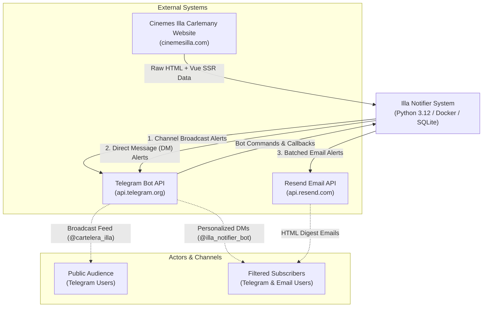
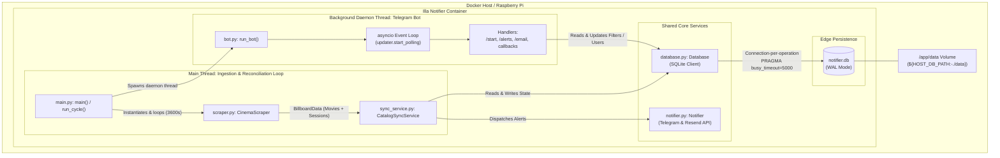

# System Overview & Architecture

This document describes the high-level architecture of **Illa Notifier** using the [C4 model](https://c4model.com/) conventions (Context and Container/Component perspectives).

---

## 1. System Context (C4 Level 1)

The following diagram illustrates how Illa Notifier interacts with external systems, channels, and subscribers.

### External Dependencies

| Dependency | Purpose | Failure Mode / Fallback |
|---|---|---|
| **Cinemes Illa Carlemany** (`cinemesilla.com`) | Target website for movie titles, genres, sessions, and posters. | If unreachable or changed, logs error, logs warning, backs off with retry adapter (5 retries), tries again on next hourly loop. |
| **Telegram Bot API** (`api.telegram.org`) | Polling bot commands (`/start`, `/alerts`, `/email`), broadcasting to channel, sending user DMs. | Filtered network reconnections; messages logged on failure; idempotency prevents duplication on reconnect. |
| **Resend Email API** (`api.resend.com`) | Transactional transactional emails for batch alerts. | Exponential backoff (up to 3 attempts, max 8s delay). If unconfigured, cleanly skips email dispatch without crashing. |

---

## 2. Container & Component Architecture (C4 Level 2 / 3)

The entire application runs as a **single containerized Linux process** hosting two synchronized concurrent domains.

---

## 3. Subsystem Breakdown

### 1. Ingestion Engine (`scraper.py`)
- **Role**: Fetches `https://cinemesilla.com/` using `requests.Session` configured with HTTP exponential retries (`urllib3.util.Retry`).
- **Parsing Technique**: Uses `BeautifulSoup` to locate the custom `<cinemaindexpage>` Vue component. Decodes and deserializes JSON attributes (`:postersurl`, `:onlytitlesinfo`, `:fullsessionsinfo`).
- **Output**: Generates immutable domain dataclasses: `BillboardData`, `ScrapedMovie`, and `Session`.

### 2. Catalog Synchronization (`sync_service.py`)
- **Role**: Coordinates comparison between freshly parsed catalog data and the persistent state stored in SQLite.
- **Cycle Routine**:
  1. Calls `db.reset_active_status()`: resets `is_active = 0` on movies and sessions.
  2. For each movie:
     - **New Movie Detection**: If `db.is_new_movie(id)` is true, triggers channel alert, queries matching Telegram bot subscribers (`db.get_matching_subscribers`), sends DMs, and queues movie for email digest.
     - **New Format Detection**: If existing, checks if new formats/languages were scheduled (e.g. newly added VOSE sessions). Alerts channel, matching subscribers, and queues for email digest.
     - Upserts movie record and all session records (`is_active = 1`).
  3. **Batch Email Dispatch**: Groups all queued new movies by email subscriber and sends a single aggregated email via Resend, logging delivery in `notification_log`.

### 3. Telegram Bot Controller (`bot.py`)
- **Role**: Handles interactive user onboarding and preference selection via Telegram commands and inline keyboards.
- **Commands**:
  - `/start`: Registers or updates user profile in `users` table; presents welcome message and quick action buttons.
  - `/alerts`: Interactive multi-category filter keyboard (Languages: `VOSE`, `VO`, `CASTELLÀ`, `CATALÀ`; Genres: `Thriller`, `Comedia`, `Drama`, etc.) with category-wide toggles.
  - `/email`: ConversationHandler workflow to set, update, enable/disable, or purge user email addresses.
  - `*`: Fallback for unknown messages, informing the user and displaying the main menu.

### 4. Notification Dispatcher (`notifier.py`)
- **Role**: Unified outbound delivery gateway.
- **Capabilities**:
  - `send_movie_alert`: Posts formatted Markdown alerts with poster photo and inline button to buy tickets to `@cartelera_illa`.
  - `send_dm`: Sends personalized direct messages to subscriber chat IDs.
  - `send_email_notification`: Formats responsive HTML email cards with posters and ticket links, calling Resend with retry backoff.

### 5. Data Access Layer (`database.py`)
- **Role**: Encapsulates all SQLite operations, schema definitions, and migration logic.
- **Concurrency Strategy**: Avoids sharing `sqlite3.Connection` across threads. Every method obtains a short-lived connection with `busy_timeout = 5000` and `foreign_keys = ON`.
